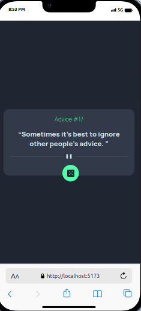
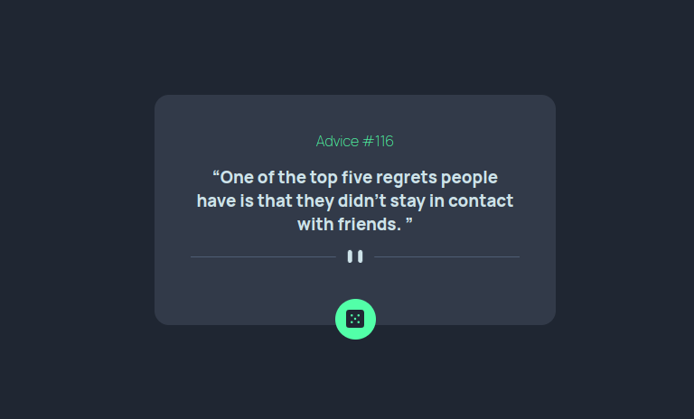

# Frontend Mentor - Advice generator app solution

This is a solution to the [Advice generator app challenge on Frontend Mentor](https://www.frontendmentor.io/challenges/advice-generator-app-QdUG-13db). Frontend Mentor challenges help you improve your coding skills by building realistic projects.

## Table of contents

- [Overview](#overview)
  - [Screenshot](#screenshot)
  - [Links](#links)
- [My process](#my-process)
  - [Built with](#built-with)
  - [What I learned](#what-i-learned)
  - [Useful resources](#useful-resources)
- [Author](#author)
- [Acknowledgments](#acknowledgments)

## Overview

### Screenshot

### Links

- Solution URL: [Github link](https://github.com/rk-codeflow/react-advice-generator)
- Live Site URL: [FEM Advice Generator](https://fem-react-advice-generator.netlify.app/)

## My process

### Built with

- CSS custom properties
- Flexbox
- [React](https://reactjs.org/) - JS library

### Useful resources

I got stucked at one point i.e. extracting value from the API. Took help from Chat GPT.

## Author

- Website - [Raj kiran Chaudhary](https://letslearn.hashnode.dev/)
- Frontend Mentor - [@rk-codeflow](https://www.frontendmentor.io/profile/rk-codeflow)
- Twitter - [@keeran_raaj](https://www.twitter.com/keeran_raaj)

## Acknowledgments

As I had already done similar project in Vanilla JavaScript, I was familiar of the most of the steps. Only difference was this time I tried to accomplish the project in React.
